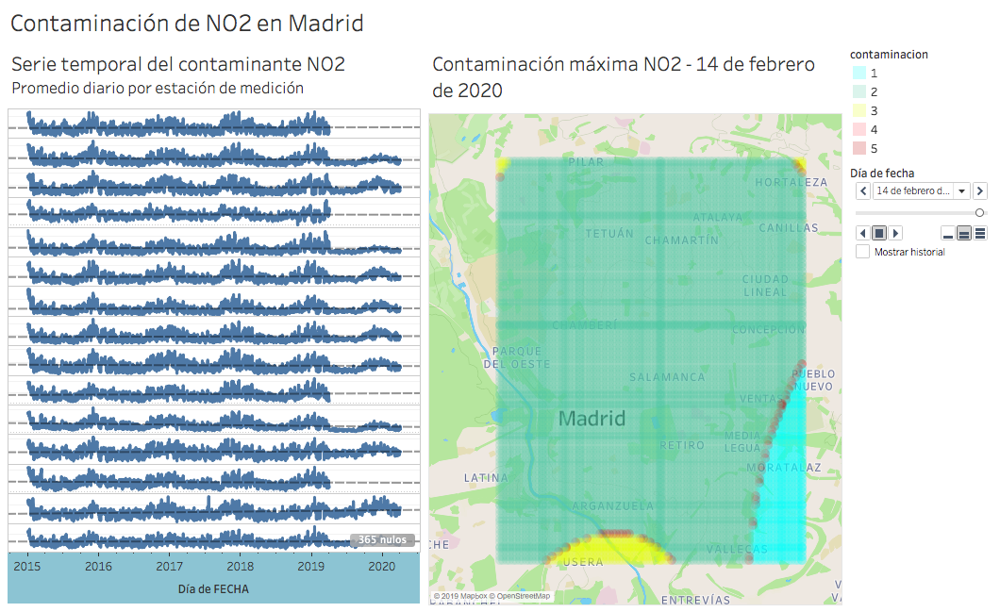

Analisis de la contaminación de NO2 de Madrid
===========================================================
`#DataScience` `#Python` `#R` `#Forecast` `#Pollution`

## Objetivo ##
El objeto de este trabajo es el analisis de la contaminación en Madrid adapatado a la [`Orden TEC/351/72019`](state_of_art/Orden_TEC:351:2019.pdf). Para ello se han tomado datos de la contaminación horaria de años anteriores, y se ha predicho la polución a un año vista.

El resultado de este proyecto es la visulación de la contaminación con el fin de explicar la tendecia de la contaminación y la comparación de la polución entre las distintas zonas de la Madrid mediante un gráfico interactivo.

## Metodología ##

### Adquisición de datos
La información de la contaminación horaria es obtenida del portal web del [Ayuntamiento de Madrid](https://datos.madrid.es/portal/site/egob/menuitem.c05c1f754a33a9fbe4b2e4b284f1a5a0/?vgnextoid=f3c0f7d512273410VgnVCM2000000c205a0aRCRD&vgnextchannel=374512b9ace9f310VgnVCM100000171f5a0aRCRD&vgnextfmt=default). Esta información es recopilada automáticamente mediante la técnica conocida en inglés como web scrapping, recogida en el documento [`ScrappingFile.ipynb`](ScrappingFile.ipynb). 

El resultado son ficheros de texto con los datos de contaminación de todas las estaciones de medición de contaminantes del ayuntamiento de Madrid. Este proceso se ha realizado empleando python. 
 
### Analisis exploratorio y limpieza de los datos
La información extraida de la página web es cargada en R Studio para ser tratada con el fin de ser la entrada para el modelo de predicción. Se mepleará el proyecto [`TFM.Rproj`](TFM.Rproj) 
Para la limpieza de los datos se empleará el fichero [`data_cleansing.R`](data_cleansing.R) Este tratamiento de la información de contaminación consistirá en un analisis de las estaciones y una estandarización de estos de forma que se puedan manipular en una dataframe, como en el que se muestra en la siguiente tabla. Debido a que la directiva europea en materia de contaminación estipula unos determinados contaminantes como dañinos, se van a seleccionar aquellos que se utilizan para obtener el Indice de Calidad del Aire (ICA)

|Estacion|Fecha|SO2|NO2|PM2.5|PM10|O3|
|--------|-----|---|---|-----|----|--|
|nº|aaaa-mm-dd hh|[µg/m3]|[µg/m3]|[µg/m3]|[µg/m3]|[µg/m3]|

Analizando las estaciones se observa que no todas ellas miden todos los contaminantes,por lo que se trabajará con los puntos de medida que recojan el NO2, que es el agente mayormente recogido por las estaciones, y será el que se emplee en la predicción.

### Modelización
El modelo predictivo se realiza utilizando la técnica de regresión ARIMA en el archivo [`TimeSeries.R`](TimeSeries.R). Se emplea la descomposición Loes, debido a la gran estacionalidad de los datos y la salida de esta descomposición se introduce en el modelo auto-ARIMA. 

El resultado es un modelo aplicado a cada una de las estaciones del estudio y recogido en un dataframe para su posterior analisis visual.

### Analisis y visualización

Al tener ya los valores de las predicciones, se procede a la visualización de estos. Para ello se guardan en una matriz 3D todas estaciones con su localización (latitud y longitud) y sus valores de datos contaminantes a lo largo del tiempo. 

Con esta información, se creará una malla que recoja una gran superficie de la ciudad de Madrid, y se interpolará la información de contaminación conocidad de las estaciones para obtener la contaminación en cada punto de la malla, que hasta ahora era desconocida.

La visuliación de los valores predecidos con el modelo ARIMA para las estaciones deseadas y el mapa de valores de contaminación se podrá visualizar en Tableau en el archivo [`Visualizacion.twb`](Visualizacion.twb)

### Especificaciones del software
#### Lenguajes de programación e interpretes

Linux shell 

Jupyter Notebook Python - Python 3.6.8 |Anaconda, Inc

RStudio - R version 3.5.2 (2018-12-20)

Tableau - 2019.2.0 de 64 bits

#### Principales librerías

|R|Python|
|--------|-----|
|`lubridate`|`os`|
|`dplyr`|`re`|
|`tidyr`|`requests`|
|`stringr`|`urllib.request`|
|`graphics`|`BeautifulSoup`|
|`ggplot2`|`ZipFile`|
|`fma`|`fileinput`|
|`expsmooth`|`numpy`|
|`forecast`|`pandas`|
|`tseries`|`re`|
|`fpp2`|`SmoothBivariateSpline,interp2d,griddata`|
|`zoo`|`pyarrow`|

#### Hardware
MacBook Pro (Late 2011) 2,4 GHz Intel Core i5, 8 GB 1333 MHz DDR3, SSD 500 GB

## Procedimiento de ejecución

**Scrapping y preparación de los datos**

    jupyter-notebook ScrappingFile.ipynb

**Limpiezad de datos y modelo**

    RStudio TFM.Rproj

    RStudio data_cleansing.R

    RStudio TimeSeries.R

**Visualización**

    Tableau Visualizacion.twb

## Acerca del autor

**Pablo Vázquez Lorenzo**
Technology consultant at Deloitte
 - https://www.linkedin.com/in/pablovazquezlorenzo
